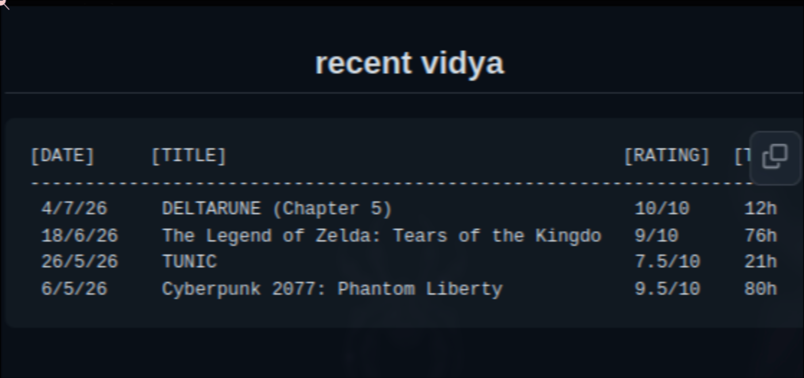
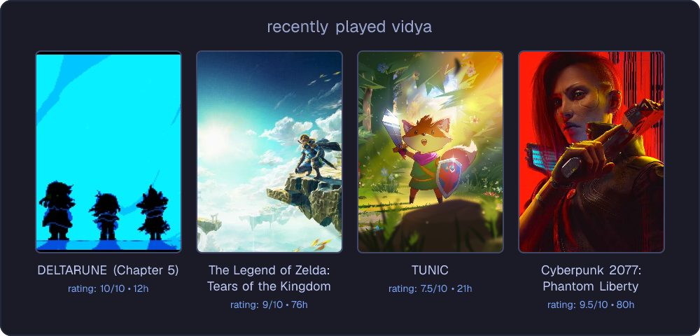

# rasmalaaiPiVidyaSync 

a resource-optimized, bare-metal telemetry daemon and serverless edge rendering pipeline built for the rasmalaaiPi ecosystem. 

it interfaces an asynchronous google sheets database with localized linux init systems, extracting multi-dimensional arrays and pushing raw json state to version control. a decoupled serverless edge api then intercepts this state and dynamically compiles a scalable svg matrix to inject deterministic visual updates directly into my profile `readme.md`.

i had a lot of video game data lying around for more than 2 years, figured making use of it by displaying it on my profile would give me some sense of productivity instead of being autistically fixated on logging everything for reasons i dont know. 

* **spreadsheet here**: https://docs.google.com/spreadsheets/d/1W9je3_pr-Pd608ET2m4Zm-GTyg7kLzrdRGCktyuXpXk/edit?usp=sharing.

the project currently only works for my personal spreadsheet, could add options for more configurations in future.

## evolution & demo output

this project started as a brute-force text script before evolving into a fully decoupled edge rendering pipeline. 

### v1.0: the prototype (markdown injection)
> the original python daemon used regex to dynamically overwrite the file tree, injecting a raw markdown table directly between `<!-- GAMES:START -->` html comments in my profile's readme.
<div align="center">
  
  <p><i>v1.0: legacy text-based database injection</i></p>
</div>

### v2.0: the edge-rendered matrix (current)
> the upgraded architecture completely bypasses regex injection. the bare-metal daemon now outputs a clean `json` state, and the vercel edge api intercepts it to natively compile a responsive tokyonight svg grid on the fly.
<div align="center">
  
  <p><i>v2.0: recently played vidya</i></p>
</div>

## systems architecture

**phase 1: the bare-metal aggregator (`/daemon`)**
- **host environment:** raspberry pi 3b+ (arm64)
- **execution engine:** python 3 (gspread, oauth2) wrapped in posix bash
- **automation:** native `systemd` timers (replacing cron)
- **data pipeline:** google sheets api -> raw 2d-matrix parsing -> stateful `telemetry.json` compilation -> headless git push
- **ci/cd layer:** isolated github action runner to enforce python linting and static syntax compilation checks

**phase 2: the edge renderer (`/api`)**
- **host environment:** vercel serverless edge network
- **rendering engine:** next.js / typescript / satori
- **integration:** rawg.io rest api (image vector sourcing)
- **pipeline:** json state intercept -> jsx dom construction -> native svg compilation

## deployment pipeline

the daemon is designed to run in a strict, isolated environment to prevent pacman dependency conflicts on arch/debian systems.

```bash
git clone https://github.com/asitos/rasmalaaiPiVidyaSync.git
cd rasmalaaiPiVidyaSync

make env
make test

cd api
npm install
npn run dev
# deployment card is hosted at https://localhost:3000/api/card
```

### docker deployment 
the python aggregator is fully containerized for isolated execution outside of the `systemd` pipeline.

```bash
cd daemon
docker build -t rasmalaai-vidya-sync .
docker run --rm -v $(pwd)/credentials.json:/app/credentials.json rasmalaai-vidya-sync
```

## systemd integration

ran invisibly, the bash wrapper is handed off to the linux kernel's init system.

1. service file (/etc/systemd/system/vidyad.service)
```ini
[Unit]
Description=rasmalaaiPiVidyaSync github telemetry
After=network.target

[Service]
Type=oneshot
# switch out with your username
User=asitos 
# example path to my bash script
ExecStart=/home/asitos/Projects/rasmalaaiPiVidyaSync/daemon/run_sync.sh

```

2. automated target deployment
```bash
sudo make systemd-install
```

## security & state management

- **headless git execution**: script tracks the repository state using `--porcelain` arguments to evaluate dirty work trees natively before initiating upstream updates.

- **secret abstraction**: token payloads (`credentials.json`) are hard-isolated out of version tracking via strict workspace `.gitignore` rules.

- **fault tolerance**: internal `gspread` headers are bypassed entirely in favor of native multi-dimensional indexing to handle empty or duplicate google sheet data boundaries.

- **cache invalidation:** url parameters (`?v=1`) are utilized to aggressively bust github's camo image proxy, ensuring real-time render delivery.

## learning notes & other stuff

what started out as just me trying to justify my weird fixation with logging every video game i play turned into a full-blown microservice architecture. i went down a massive rabbit hole just to put a cool image on my github profile, but here is what i actually walked away with:

*   **infrastructure (rpi & systemd):** i finally ditched hacky `cron` jobs and learned how linux *actually* wants you to run background tasks. wiring up proper `systemd` timers on my raspberry pi made me understand the daemon lifecycle—and the absolute peace of mind that comes with headless scripts running silently without me having to babysit them.

*   **cloud & IAM (gcp):** google cloud's iam console is terrifying at first glance, but i managed to navigate it and set up secure oauth2 service accounts. now my daemon can read my google sheet without me ever having to expose my root google credentials. AND IT IS SO FUCKING SLOW WHY DOES IT EAT UP 8GIGS OF RAM.

*   **serverless edge compute (vercel & next.js):** stepping out of my cozy python/bash bubble into the javascript/node ecosystem (`npm`, `npx`, typescript) was a trip. i learned how to deploy stateless apis to vercel's edge network, which honestly feels like magic compared to managing a traditional backend server.

*   **dynamic rendering (satori):** this was arguably the coolest part. i learned how to use vercel's satori engine to force react jsx components to compile directly into scalable vector graphics (`.svg`) on the fly, completely bypassing standard browser dom rendering.

*   **data pipelines (python & json):** i realized that if my vercel app pinged google sheets and rawg.io every time someone loaded my profile, i'd get rate-limited instantly. by decoupling the system—letting python do the heavy scraping offline and dumping a clean `json` state for the frontend to read, i built an architecture that is completely immune to api bottlenecks.
